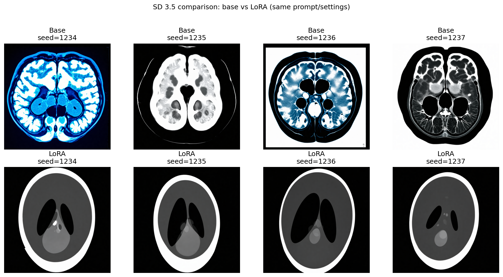
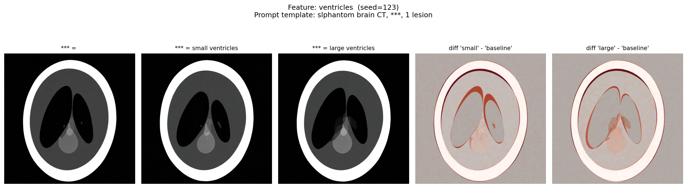
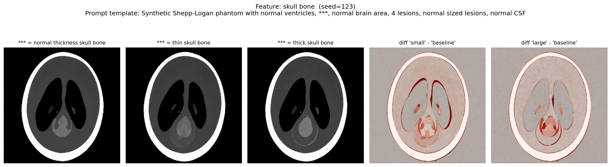
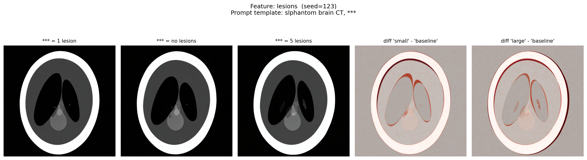
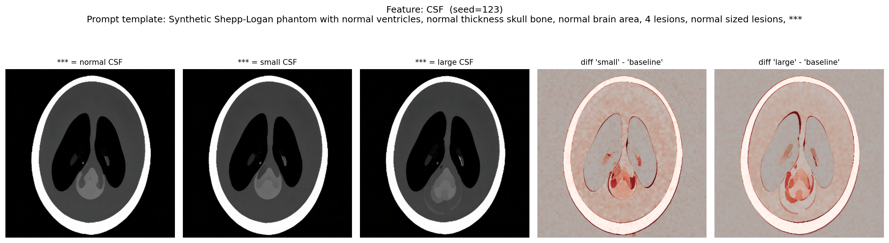

# Fine Data Generation

This repo is a small, practical playground for:

- running **text-to-image generation** with Stable Diffusion-style models
- comparing *how different methods/models respond to the same prompt*
- fine-tuning a model with a **LoRA** to generate images in the style/content of *your* dataset

It includes an implementation inspired by (and conceptually based on) [Attend-and-Excite](https://github.com/yuval-alaluf/Attend-and-Excite) for prompt-guided attention control.

## What you can do here

1) **Compare models/methods fairly** (same prompt + same seeds) and visualize the results as a grid.

2) **Train a LoRA** (Diffusers + Accelerate) on your own data, then:
     - run inference with the trained LoRA
     - do a simple explainability check by replacing phrases in the prompt and plotting difference heatmaps

## Notebooks

### 1) Compare multiple models on the same prompt

- Notebook: [notebooks/compare_models.ipynb](notebooks/compare_models.ipynb)
- What it shows: a side-by-side figure where **rows = seeds** and **columns = models/methods**.

The notebook compares (depending on what you have access to):
- Stable Diffusion v1.4 (standard)
- Attend-and-Excite on SD v1.4
- Stable Diffusion 3.5 Medium (optional; requires Hugging Face access)

Figure produced by this workflow:


### 2) Train + use a LoRA (SD 3.5)

- Notebook: [notebooks/train_sd35_lora.ipynb](notebooks/train_sd35_lora.ipynb)
- What it does:
    - validates your dataset folder (images + optional metadata.jsonl)
    - generates a non-interactive Accelerate config
    - prints a reproducible `accelerate launch ...` command for LoRA training
    - after training: finds LoRA weights, loads them for inference, and runs comparisons

This notebook does **not** download or include a dataset — you point it at your own images.

Example outputs from the notebook:



The notebook also includes a lightweight explainability view: change a phrase in the prompt (e.g. "normal-sized" → "enlarged") and visualize where the image changes most. Each feature produces a row showing the baseline, the two variations, and difference heatmaps:







## Install

Recommended (editable install so notebooks import local code):

```bash
python -m venv .venv
source .venv/bin/activate
pip install -e .
```

Alternative: `pip install -r requirements.txt`

## Hugging Face token (SD 3.5 / gated models)

Some models (e.g. SD 3.5) require that you accept terms on Hugging Face and provide a token:

```bash
export HF_TOKEN=hf_...
```

Restart the notebook kernel after setting the token.
